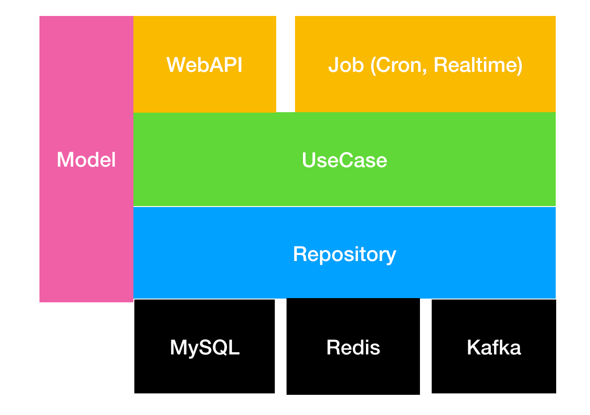
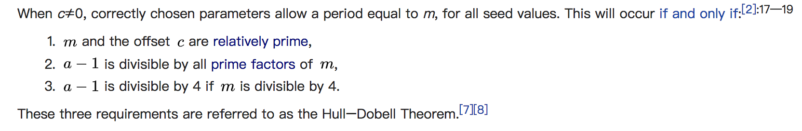
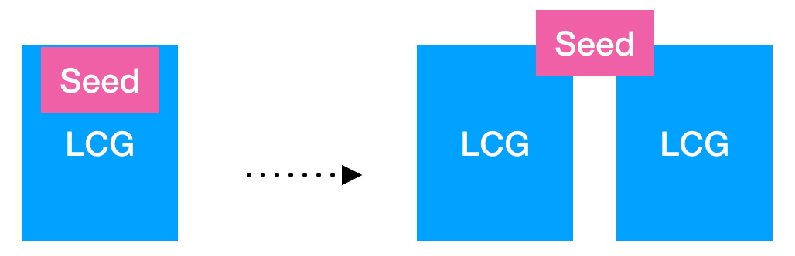
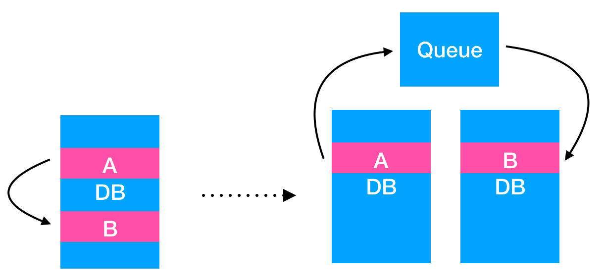
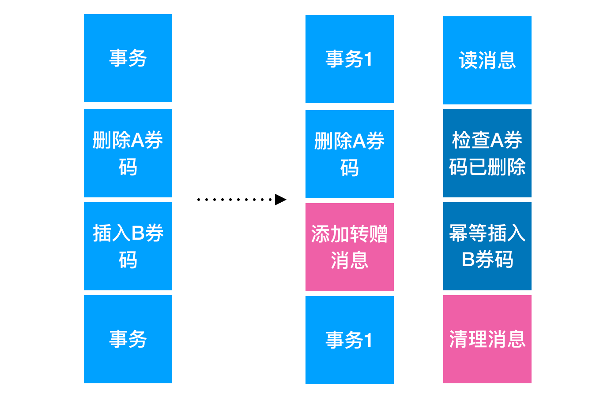
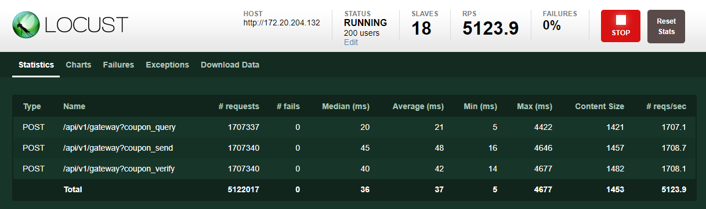
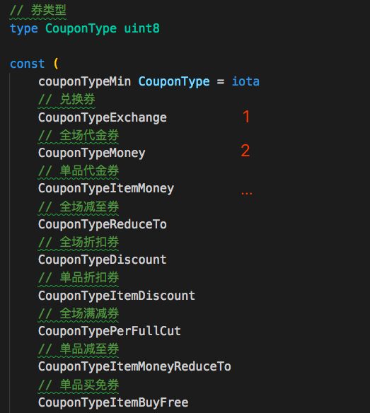
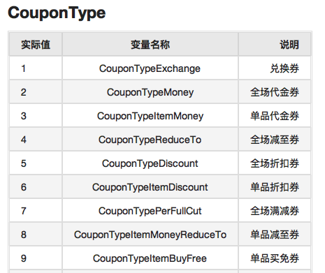

## Go在新零售营销领域的实践

许嘉华@讯联数据

Note:

1. 我是许嘉华，来自讯联数据。在讯联做的比较杂，最近有利用Go做了一个优惠券系统，跟大家分享下。初来乍到，请多包涵。
2. 只要写Go，放心跨平台编译，并发也简单。虽然没Java生态好，轮子多，其他都很好。


## "新"零售与优惠券系统


 


优惠券系统 use cases：

1. 商家向用户发一张券
1. H5活动，用户主动领一张券
1. APP里，用户向用户转赠一张券

NOTE:

1. 新零售的核心是数据，精细化数据化运营。
1. 圈人（圈出合适的，最大化利益的人）
1. 权益投放 （比如优惠券）


## 分享这些点

1. 券码设计
1. 分库分表：支持大量用户
1. 分布式事务：用户间转赠
1. 性能测试
1. Best Practice
1. 遇到的坑

NOTE:

1. 优惠券系统，技术角度要解决的问题




NOTE:

1. 比较简单的代码结构，一定的分层。


## 1. 券码设计

1. 不可重复
1. 不可预测
1. 不能太长（有手输场景）
1. 数字码
1. 能包含sharding key（可分库分表）

NOTE:

1. 产品要求。UUID这种及早放弃。
1. 需要一个随机数算法。


### Linear congruential generator （线性同余）

伪随机数生成算法



精心挑选的参数，可保证在整个周期(m)内随机数不重复。

试验：https://github.com/XUJiahua/gomeetup20181021/blob/master/code/lcg_randomness/lcg_randomness.ipynb

NOTE:

1. 伪随机数算法（计算机模拟）。数学证明已经进入了我的知识盲区。计算机穷举试验。
非常古老的算法，1958年。https://en.wikipedia.org/wiki/Linear_congruential_generator
1. 在Java中的应用，https://github.com/openjdk-mirror/jdk7u-jdk/blob/master/src/share/classes/java/util/Random.java
1. 谈谈随机性（周期性）。


### 多进程LCG



1. `SELECT ? FROM ? WHERE ? FOR UPDATE` 从数据库获取seed，并持有写锁 
1. LCG生成一批随机数并洗牌
1. `UPDATE ? SET ? WHERE ?` 更新seed

NOTE:
随机数种子，单机保存 -> 数据库存储。
每个进程拿到随机数种子后预存一批随机数在进程。然后更新种子到数据库中。


### 券码用完了怎么办

换个前缀。

NOTE:
如果对接过支付宝、微信，可以发现他们的支付条码前缀会定时更新。说明码不够。


## 2. 分库分表

coupon表为例，需要满足两个场景：

1. 根据UID查，比如钱包应用里看我所有券
1. 根据券码查，比如商户核销券码

而sharding key只有一个。

有异构索引的方案，但不妨先考虑下其他轻量的办法。

NOTE:

1. 有导出券码做异业交换的场景，所以券不一定与UID绑定的。
1. 异构索引，简单来说，维护A、B两张内容一样的表，一张为uid索引，一张为code索引。数据的同步内部通过队列来完成。通过冗余的方式，提高查询性能。
1. 单实例 -> 硬件提升垂直扩容 -> 读写分离 -> 分库分表（垂直切分）-> 分库分表（水平切分）
1. 怎么简单怎么来。实际效果以压测后的报告为准。


### 一个朴素的想法

1. 引入新字段作为sharding key：shardID = HASH(UID) % M。
1. 券码再包含shardID。因为券码不能太长，M选10000。

问题：2次hash是否影响到分片数据平衡性呢？

试验：https://github.com/XUJiahua/gomeetup20181021/blob/master/code/hash_randomness/hash_randomness.ipynb

NOTE:
如果查券码能带上UID是最完美的，用UID作为sharding key。但是。。。


## 3. 分布式事务 


基于队列的分布式事务

NOTE:
数据分片后，两条数据可能落在不同的DB，不同的表里了。


### 转赠的场景



NOTE:
事务补偿。幂等？


### 数据库事务与业务逻辑

业务逻辑通过回调

```golang
// DAL
type CouponRepository interface {
    DeleteCodeWithDo(mid, code string, do func() error) (err error)
    ...
}
```

NOTE:
不让数据库事务对象满地跑。封装在代码里。


## 4. 性能测试



两个目的：

1. 瓶颈调优
2. 预估生产配置

NOTE:
Locust通过添加slave数量提高并发请求量。因为一个Python Slave只能用满一个CPU。可以尝试下Go版Slave。https://docs.locust.io/en/latest/third-party-tools.html
通过推理写出好代码。或是快糙猛写完，使用工具压出瓶颈。工具是检查器。
Locust(Python) 分布式压测工具，简单易用。


### pprof


采样：

```
watch -n 60 wget http://localhost:8000/debug/pprof/profile\?seconds\=60
```

NOTE:

1. Go本身的工具链非常完善，而且是越来越完善了。现在pprof还内置了火焰图了。
1. 如果系统出现性能问题，建议大家看看tracer/pprof这些工具。


## 5. Best Practice


### go generate ./...

`//go:generate swagger generate spec -o swagger/swagger.json`

基于代码生成文档、生成代码。文档更新、与程序打包同步。




NOTE:

1. 当时定义，用的int。看到1、2、3，这是什么券啊？需要趴代码看，然后一个个数。





### 拼SQL更合适，ORM不是万能的

为了兼容DRDS/TDDL，ORM框架里的别名代码里都得去掉


## 6. 遇到的坑


### 机缘巧合下Logrus崩了

Workaround：
```golang
var phase1Logger = func() *log.Entry {
	return log.WithField("rebind_transaction", "phase1")
}
```


## Thank You

http://www.cardinfolink.com
