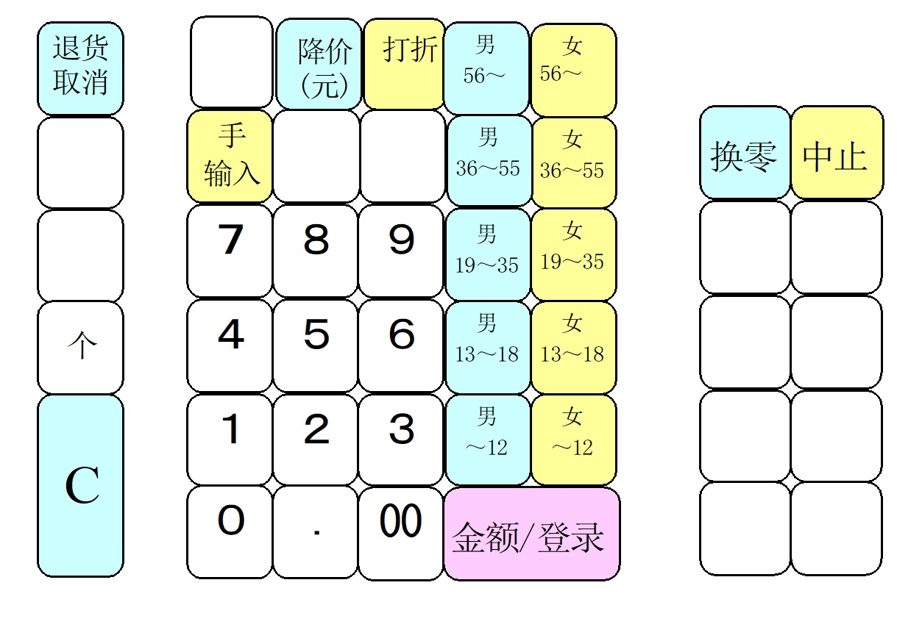
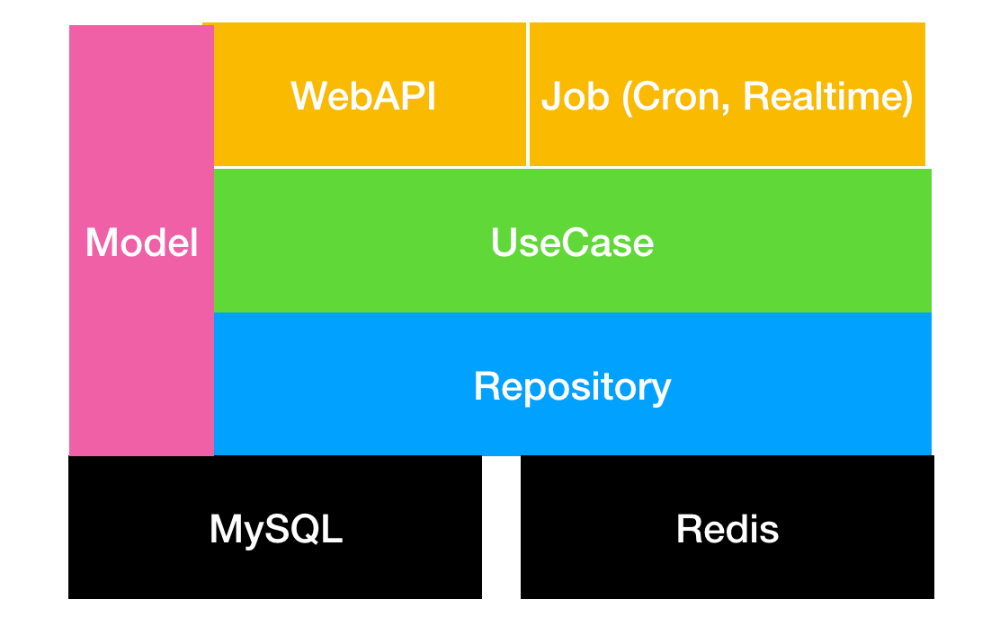
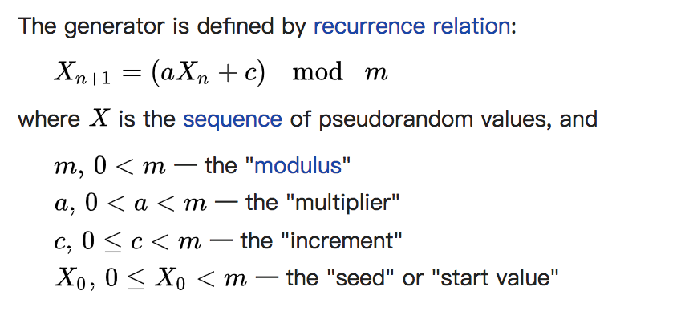

## Go在新零售营销领域的实践

许嘉华@讯联数据

Note:

1. 我是许嘉华，来自讯联数据。在讯联做的比较杂，最近有利用Go做了一个优惠券系统，跟大家分享下。初来乍到，请多包涵。
2. 为什么选择Go。只要写Go，放心跨平台编译，并发也简单。


## "新"零售与优惠券系统

新零售，用线上运营顾客的方式运营线下顾客。


NOTE:

1. 新零售，用线上运营顾客的方式运营线下顾客。首先要做的是线下的数字化，与线上数据打通。现在大家比较熟悉的超市、便利店让你办会员卡，微信扫一扫就可以了，就是一种线下数据数字化的手段。
1. 有了用户数据，就能刻画出用户画像，做用户分层，与线上那套是一样的。营销的传播方式可能多样，但是送的东西是不变的，比如给沉睡客户送一张券，期望激活它。


便利店收银机标签按键
<!-- .element height="70%" width="70%" -->

NOTE:
线下曲线收集用户信息。网上的图。


### 优惠券系统（权益系统）

1. 商家向用户发一张券
1. 导出券码，异业交换
1. H5活动，用户主动领一张券
1. APP里，用户向用户转赠一张券

NOTE:
设计一个优惠券系统。在一个私有化部署的案例中，客户有2000w顾客。


## 分享这些点

1. 券码设计
1. 分库分表：怎么定sharding key
1. 分布式事务：用户间转赠
1. 性能测试
1. Best Practice

NOTE:

1. 优惠券系统，技术角度要解决的问题


非常简易的架构

<!-- .element height="70%" width="70%" -->

NOTE:

1. 比较简单的代码结构，一定的分层。


## 1. 券码设计

1. 不可重复
1. 不可预测
1. 不能太长
1. 数字码

NOTE:

1. 产品要求。UUID这种及早放弃。
1. 券码中需要包含随机数。但是直接使用语言内置的随机数包是不可能的。开始调研随机数算法。简单，够理解，好维护。
1. 有手输场景


### NO

1. UUID, GUID
1. MongoDB ObjectId
1. Twitter Snowflake


### Linear congruential generator （线性同余）

伪随机数生成算法



精心挑选的参数，可保证在整个周期(m)内随机数不重复。

试验：https://github.com/XUJiahua/gomeetup20181021/blob/master/code/lcg_randomness/lcg_randomness.ipynb

NOTE:

1. 伪随机数算法（计算机模拟）。数学证明已经进入了我的知识盲区。计算机穷举试验。
非常古老的算法，1958年。https://en.wikipedia.org/wiki/Linear_congruential_generator
1. 在Java中的应用，https://github.com/openjdk-mirror/jdk7u-jdk/blob/master/src/share/classes/java/util/Random.java


### 多进程LCG


1. `SELECT ? FROM seed WHERE ? FOR UPDATE` 从数据库获取seed，并持有写锁
1. LCG生成一批随机数并**shuffle**
1. `UPDATE seed SET ? WHERE ?` 更新seed

NOTE:
1. 随机数种子，单机保存 -> 数据库存储。
1. 每个进程拿到随机数种子后预存一批随机数在进程。然后更新种子到数据库中。
1. 券码用完了怎么办。换个前缀。如果对接过支付宝、微信，可以发现他们的支付条码前缀会定时更新。说明码不够。


## 2. 分库分表

优惠券表，有两个独立的查询条件：

1. 根据UID查，比如钱包应用里看我所有券
1. 根据券码查，比如商户核销券码

而sharding key只有一个。

有异构索引的方案，但不妨先考虑下其他轻量的办法。

NOTE:

1. 有导出券码做异业交换的场景，所以券不一定与UID绑定的。
1. 异构索引，简单来说，维护A、B两张内容一样的表，一张为uid索引，一张为code索引。通过冗余的方式，提高查询性能。成本在于，维护第二份数据的服务器成本，两份数据一致性的保证。
1. 怎么简单怎么来。实际效果以压测后的报告为准。
1. 取模分片的思路。


### 一个朴素的想法

1. 引入新字段作为sharding key：shardID = HASH(UID) % M。
1. 券码再包含shardID。因为券码不能太长，M选10000。

问题：2次hash是否影响到分片数据平衡性呢？

试验：https://github.com/XUJiahua/gomeetup20181021/blob/master/code/hash_randomness/hash_randomness.ipynb

NOTE:


## 3. 分布式事务 


基于队列的分布式事务

NOTE:
数据分片后，两条数据可能落在不同的DB，不同的表里了。


### 转赠的场景

<!-- .element height="70%" width="70%" -->


没有装备事务消息

1. 消息服务不是事务的：消息存了，数据库更新可能失败。
1. 消息服务不是事务的：清理消息可能失败。

NOTE:
1. 针对消息存了，但是数据更新失败的。需要补偿措施。
1. 所以需要插入操作是幂等的。


### 数据库事务与业务逻辑

业务逻辑通过回调

```golang
// DAL
type CouponRepository interface {
    DeleteCodeWithDo(mid, code string, do func() error) (err error)
    ...
}
```

NOTE:
不让数据库事务对象满地跑。封装在代码里。


## 4. 性能测试


两个目的：

1. 瓶颈调优
2. 预估生产配置

NOTE:
Locust通过添加slave数量提高并发请求量。因为一个Python Slave只能用满一个CPU。可以尝试下Go版Slave。https://docs.locust.io/en/latest/third-party-tools.html
通过推理写出好代码，或是快糙猛写完，都要使用工具压出瓶颈。


### pprof


采样：

```
watch -n 60 wget http://localhost:8000/debug/pprof/profile\?seconds\=60
```

pprof：

```
pprof -http=:9000 coupon <profile file>
```

NOTE:

1. Go本身的工具链非常完善，而且是越来越完善了。现在pprof还内置了火焰图了。
1. 如果系统出现性能问题，建议大家看看tracer/pprof这些工具。


## 5. Best Practice


### go generate

`//go:generate swagger generate spec -o swagger/swagger.json`

基于代码生成文档、生成代码。文档更新、与程序打包同步。


我：1、2、3。。。

<!-- .element height="50%" width="50%" -->

NOTE:

1. 当时定义，用的int。看到1、2、3，这是什么券啊？需要趴代码看，然后一个个数。


我：麻烦先看下文档


### proxy = struct embedding + interface

加缓存、加埋点

举例：https://gist.github.com/XUJiahua/4457e4358cf2957220c573f6edd6ea06

NOTE:
没有Java Spring配置+注解方便。但是比较明确。
embedding："继承"方法、属性。所以"继承"后的结构体也隐式实现了interface。


## Thank You

john.xu@cardinfolink.com

http://www.cardinfolink.com
